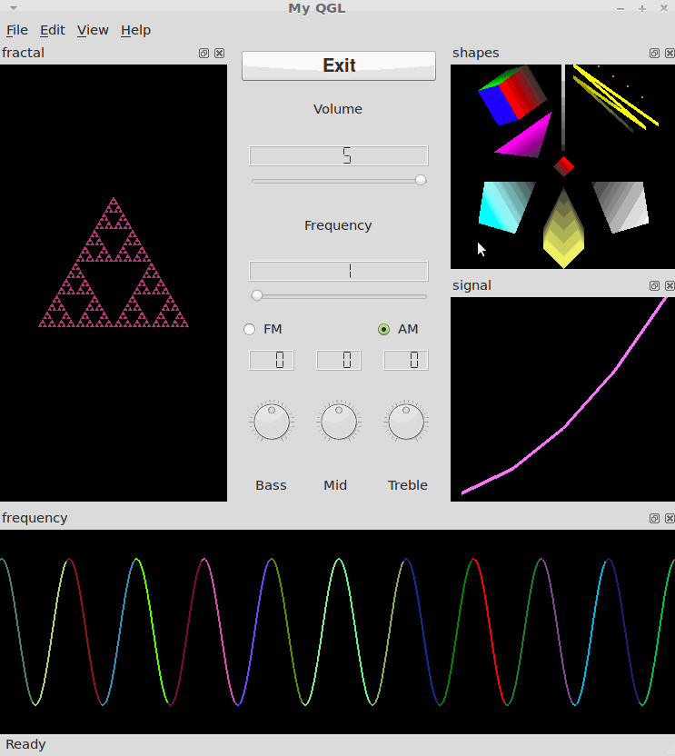

# QT/OpenGL

A demonstration of UI development using QT and OpenGL by expanding on the original [simple QT radio](https://github.com/kevin-funderburg/simple-qt-radio) and [QT Radio in Window](https://github.com/kevin-funderburg/qt-radio-in-window) and [qt-opengl-graphics-ui](https://github.com/kevin-funderburg/qt-opengl-graphics-ui).

>NOTE: The screenshot looks a little different than the other projects because this was executed within a Linux Mint VM, rather than using Docker like the previous projects

## Contents
<!-- TOC -->

- [About](#about)
- [Configuration](#configuration)
- [Version History](#version-history)

<!-- /TOC -->

## About

- The goal of this project was to learn about graphics development by
    - Transforming/scaling and adding shading to the shapes made earlier
    - Load a file (`S2.txt`) with given data points representing y-values for the function y = x^2, then draw a graph representing the data.
    - Draw a fractal image with a recursion of 5 levels that changes color.
    - Use the volume and frequency sliders from the radio to provide input to another GL object to draw the representative wave using the formula `f(t) = Acos2πft` where `A = volume` and `f = frequency`.

## Configuration
- This was written and executed using Linux Mint VM, with QT 4.7,

## Version History

- v1.0.0
