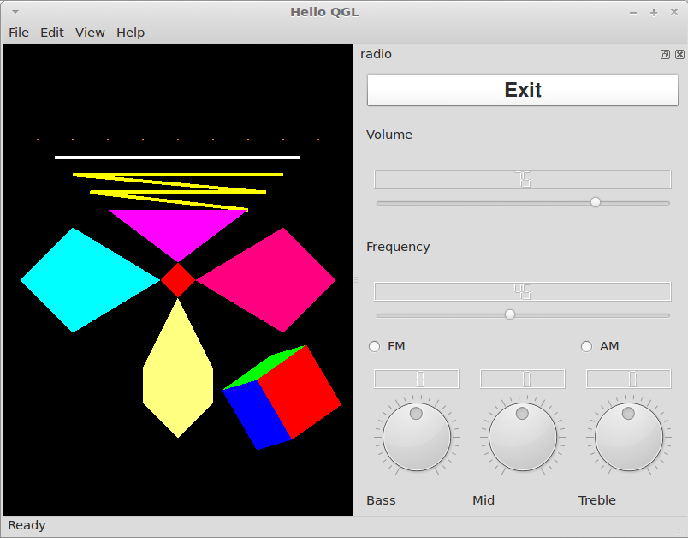

# QT and OpenGL

A demonstration of UI development using QT by expanding on the original [simple QT radio](https://github.com/kevin-funderburg/simple-qt-radio) and [QT Radio in Window](https://github.com/kevin-funderburg/qt-radio-in-window) projects by incorporating graphics with OpenGL.

>NOTE: The screenshot looks a little different than the other projects because this was executed within a Linux Mint VM, rather than using Docker like the previous projects

## Contents
<!-- TOC -->

- [About](#about)
- [Configuration](#configuration)
- [Version History](#version-history)

<!-- /TOC -->

## About

- The goal of this project was to learn about graphics development by creating a GL widget and creating 8 different 2D objects, all with differing colors, and 1 3D cube with every face a different color and rotated so each side could be seen.
- Once that was accomplished it was incorporated into the previously designed [QT Radio in Window](https://github.com/kevin-funderburg/qt-radio-in-window) project.

## Configuration
- This was written and executed using Linux Mint VM, with QT 4.7,

## Version History

- v1.0.0
